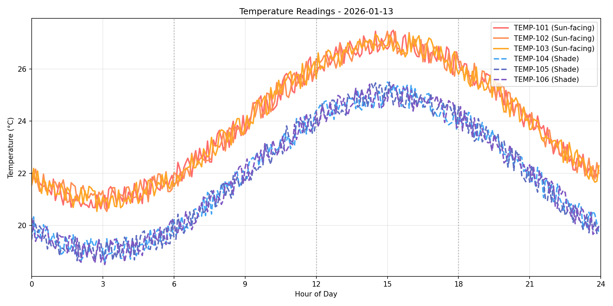

# Dormitory Digital Twin

An AI-powered building management system that combines graph databases, time-series data, and LLM capabilities to answer natural language questions about a dormitory building.

## Features

- **Graph-based Building Model** - Neo4j stores building topology, equipment, and sensor relationships
- **Time-Series Sensor Data** - InfluxDB tracks temperature and occupancy readings over time
- **AI Agent Interface** - Natural language queries powered by Google Gemini with agentic reasoning
- **Full Observability** - All queries and tool calls traced in Langfuse
- **Interactive Chat UI** - Streamlit-based interface with example questions

## Architecture

### Agentic Loop Pattern

The system uses a **PlannerAgent** that iteratively analyzes questions and decides which database(s) to query:

1. User asks a natural language question
2. Agent analyzes and decides which tools to use
3. Agent calls `execute_cypher` (Neo4j) or `execute_sql` (InfluxDB)
4. Agent sees results and may call additional tools
5. Agent synthesizes final answer

All steps are traced in Langfuse for observability.

### Database Schema

**Neo4j Graph Database:**
- 6 dorm rooms (101-106) with sensors
- 2 mechanical rooms (M1, M2) with AC units
- AC-1 (in M1) services rooms 101-103 (sun-facing)
- AC-2 (in M2) services rooms 104-106 (shade-facing)

**InfluxDB Time-Series:**
- Temperature sensors: Diurnal pattern with peak at 3pm, sun-facing rooms 2°C warmer
- Occupancy sensors: Two student profiles (full-time vs night-worker schedules)
- 7 days of historical data


## Technology Stack

- **Python 3.12+** with `uv` for dependency management
- **Neo4j** - Graph database for building topology
- **InfluxDB 3** - Time-series database for sensor readings
- **Google Gemini** - LLM for natural language understanding
- **Langfuse** - Observability and tracing
- **Streamlit** - Web-based chat interface

## Setup

### Prerequisites

- Python 3.12+
- [uv](https://github.com/astral-sh/uv) package manager
- Neo4j (installed via Homebrew)
- InfluxDB 3 (installed via Homebrew)
- Google Gemini API key

### Installation

1. **Clone the repository**
   ```bash
   git clone <repo-url>
   cd dormitoryDigitalTwin
   ```

2. **Install dependencies**
   ```bash
   uv sync
   ```

3. **Configure environment variables**
   ```bash
   cp .env.example .env
   # Edit .env and add your API keys
   ```

   Required variables:
   - `GEMINI_API_KEY` - Google Gemini API key
   - `NEO4J_URI`, `NEO4J_USER`, `NEO4J_PASSWORD` - Neo4j connection
   - `INFLUXDB_HOST`, `INFLUXDB_PORT`, `INFLUXDB_TOKEN`, `INFLUXDB_DATABASE` - InfluxDB connection
   - `LANGFUSE_PUBLIC_KEY`, `LANGFUSE_SECRET_KEY` (optional) - Langfuse tracing

4. **Start databases**
   ```bash
   # Start Neo4j
   brew services start neo4j

   # Start InfluxDB 3
   influxdb3 serve --node-id dormitory --object-store file --data-dir ./influxdb-store
   ```

5. **Seed databases**
   ```bash
   # Seed Neo4j with building model
   uv run python graph/seed.py

   # Seed InfluxDB with 7 days of sensor data
   uv run python timeseries/seed.py
   ```

6. **Verify connections**
   ```bash
   uv run python -c "from db import Neo4jClient; Neo4jClient().verify()"
   uv run python -c "from db import InfluxClient; InfluxClient().verify()"
   ```

## Usage

### Start the Chat Interface

```bash
uv run streamlit run chat/app.py
```

The interface will open at http://localhost:8501

### Example Questions

The chat interface includes sample questions organized by complexity:

**Graph Queries (Neo4j)** - Simple topology lookups:
- "Which AC unit services room 103?"
- "What sensors are installed in room 101?"
- "What rooms are serviced by which Air Conditioning Units?"

**Time-Series Queries (InfluxDB)** - Sensor data analysis:
- "What's the latest temperature in room 105?"
- "What are the typical occupancy patterns for the dorms?"
- "Which room has the highest temperature recently?"

**Hybrid Queries** - Multi-database reasoning:
- "Which occupied rooms are over 25°C?"
- "Show all rooms with their latest temperatures"
- "What times of day are we observing hot temperatures? In which dorm rooms? Are these rooms related to an Air Conditioning Unit?"

**Graceful Failure Tests** - Error handling:
- "What's the temperature in room 999?" (non-existent room)
- "Delete all temperature readings" (blocked write operation)

## Project Structure

```
/
├── db/                     # Database client modules
│   ├── neo4j_client.py     # Neo4j connection & queries
│   └── influx_client.py    # InfluxDB connection & queries
├── graph/                  # Neo4j graph database
│   └── seed.py             # Populate building model
├── timeseries/             # InfluxDB time-series data
│   ├── generators.py       # Sensor data generation
│   └── seed.py             # Populate sensor readings
├── chat/                   # Chat interface
│   ├── app.py              # Streamlit UI
│   ├── llm.py              # Gemini client with Langfuse tracing
│   ├── validators.py       # Read-only query validators
│   ├── agents/
│   │   └── planner.py      # Main agent with agentic loop
│   ├── tools/
│   │   ├── neo4j_tool.py   # execute_cypher tool
│   │   └── influx_tool.py  # execute_sql tool
│   └── prompts/
│       ├── planner.py      # System prompt
│       ├── neo4j.py        # Cypher examples
│       └── influx.py       # SQL examples
├── schema.md               # Database schema documentation
├── CLAUDE.md               # Claude Code instructions
└── README.md               # This file
```

## Database Access

**Neo4j Web UI:** http://localhost:7474
- Connection: `bolt://localhost:7687`
- Username: `neo4j`
- Password: (from `.env`)

**InfluxDB:** http://localhost:8181
- Database: `dormitory`

## Observability

All agent interactions are traced in Langfuse:
- LLM calls with prompts and responses
- Tool executions with queries and results
- Iteration counts and reasoning steps

Access your traces at https://cloud.langfuse.com (or your self-hosted instance).

